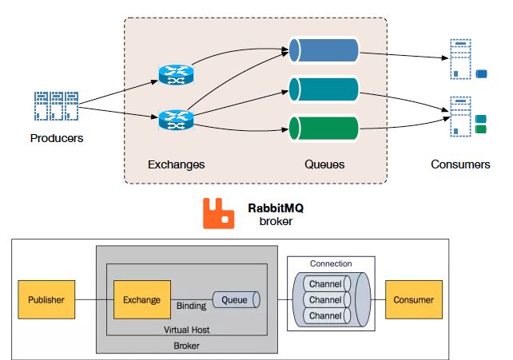
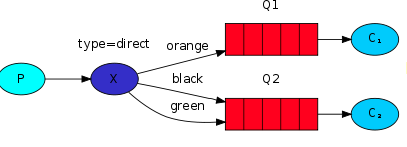
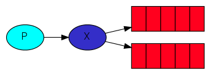
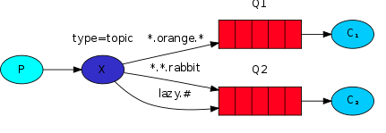

# Celery Study
Celery Python实现分布式[队列]服务 支持即时任务&定时任务

## 多语言  不是太友好
可以通过暴露 HTTP 的方式进行，任务交互以及其它语言的集成开发。
- [Node.js](https://github.com/mher/node-celery) 【非官方】已停止维护
- [Php](https://github.com/gjedeer/celery-php)                【非官方】
- [GO](https://github.com/gocelery/gocelery)   【非官方】  支持版本 < Celery 4.0             

## 5大金刚
- Task
    - 字面意思任务
- Broker
    - 队列
    - Celery 本身不提供队列服务，一般用 Redis 或者 RabbitMQ 来扮演 Broker 的角色
- Worker
    - 消费者
    - 如果出现丢失连接或连接失败，职程（Worker）和客户端会自动重试，并且中间人通过 主/主 主/从 的方式来进行提高可用性。
- Beat
    - 定时调度器  (cron定时发给Broker)
- Backend
    - 保存任务的执行结果
    - 执行成功OR失败  


### 以redis 为 Broker 示例  redis_demo
- install `pip3 install -U "celery[librabbitmq,redis,auth,msgpack]"`
```python3
# tasks.py
from celery import Celery

# 初始化  app
app = Celery('tasks', broker='redis://localhost:6379/0')

@app.task    # 函数用app.task 装饰器修饰之后，就会成为Celery中的一个Task。
def send_msg(msg):
    print("get Message ", msg)
    return "success" 
```
- 启动worker
    - `celery -A tasks worker --loglevel=info` 
    - -A： 指定 celery 实例在哪个模块中


## RabbitMQ
- install
    - `docker run -dit --name Myrabbitmq -e RABBITMQ_DEFAULT_USER=admin -e RABBITMQ_DEFAULT_PASS=admin -p 15672:15672 -p 5672:5672 rabbitmq:management-alpine`
    - HTTP: 15672  
    - TCP: 5672


####  基础概念
- Producer
- Exchange 交换机 
    - 接受Producer 消息  更具ExchangeType 决定 发送到那个queue
    - ExchangeType  
        - direct
        - Fanout
        - Topic
- Binding Key:
    - 表示Exchange 与MQ 通过binding key进行连接 关系是固定了初始化的时候，我们就会建立该队列。
- Routing Key:
    - 生产者在将消息放送给Exchange的时候，一般会指定一个Routing key 来指定这个消息的路由规则。这个routing key需要与Exchange Type及binding key联合使用才能生，我们的生产者只需要通过指定routing key来决定消息流向哪里。
- Message Queue 
    - 存放交换机消息
- Consumer
#### 核心概念 ExchangeType
[参考文献](https://www.rabbitmq.com/tutorials/amqp-concepts.html)
##### direct 交换器


一一对应(点播)
RoutingKey与该Exchange关联的所有Binding中的BindingKey进行比较，如果相等，则发送到该Binding对应的Queue中。
FBI Warning：如果找不到指定的exchange，就会报错。但routing key找不到的话，不会报错，这条消息会直接丢失，所以此处要小心。

##### fanout交换器


广播
fanout类型的exchange，那么routing key就不重要了。因为凡是绑定到这个exchange的queue，都会受到消息。

##### topic交换器


更具路由KEY 进行匹配 一个消息可能进入多个MQ 或在1个MQ


### 总结celery
- 跨语言 不友好  官方没有提供其他语言的SDK  其他语言的社区提供的包 缺少功能
 